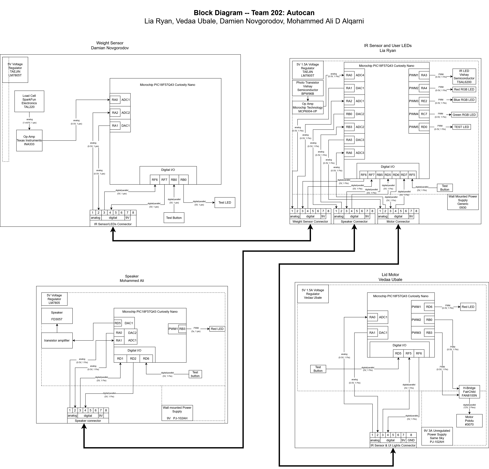

## Explanation

The weight and height subsystems both send signals to the external IR sensor subsystem. Based off of the signals sent by those two to the external IR subsystem, that subsystem lets the user know that either the weight limit or height limit has been exceeded through LEDs. The external IR subsystem sends signals to the motor subsystem. This is because the motor subsystem only activates when the IR sensor in the external subsystem detects that a user has waved his/her hand to open the trash can. Our block diagram reflects all of that.

## Block Diagram

## Connections Table

Here is a table describing all of the conections between each team member's subsystem. This table shows what the functionality of each pin on the connector is.

